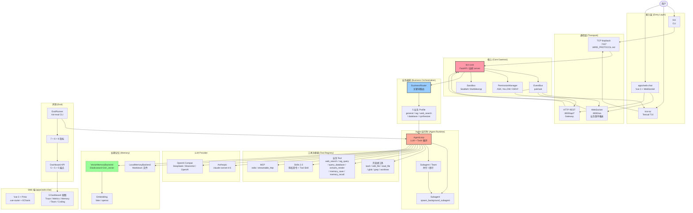
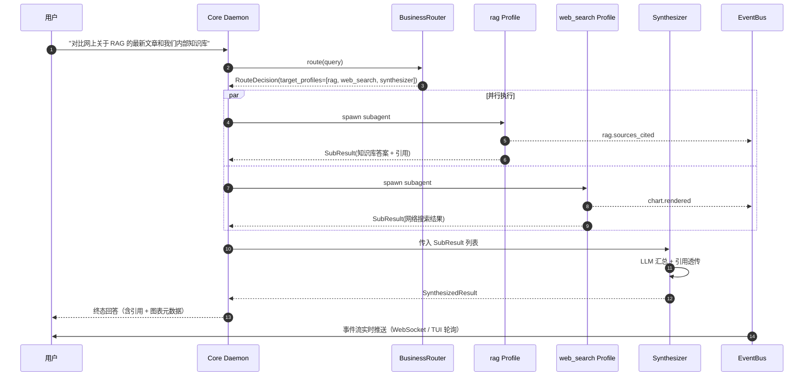
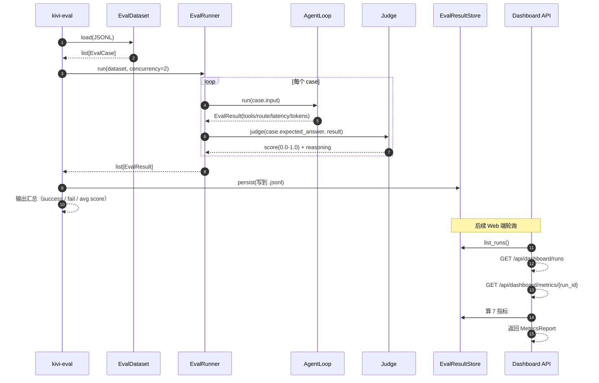
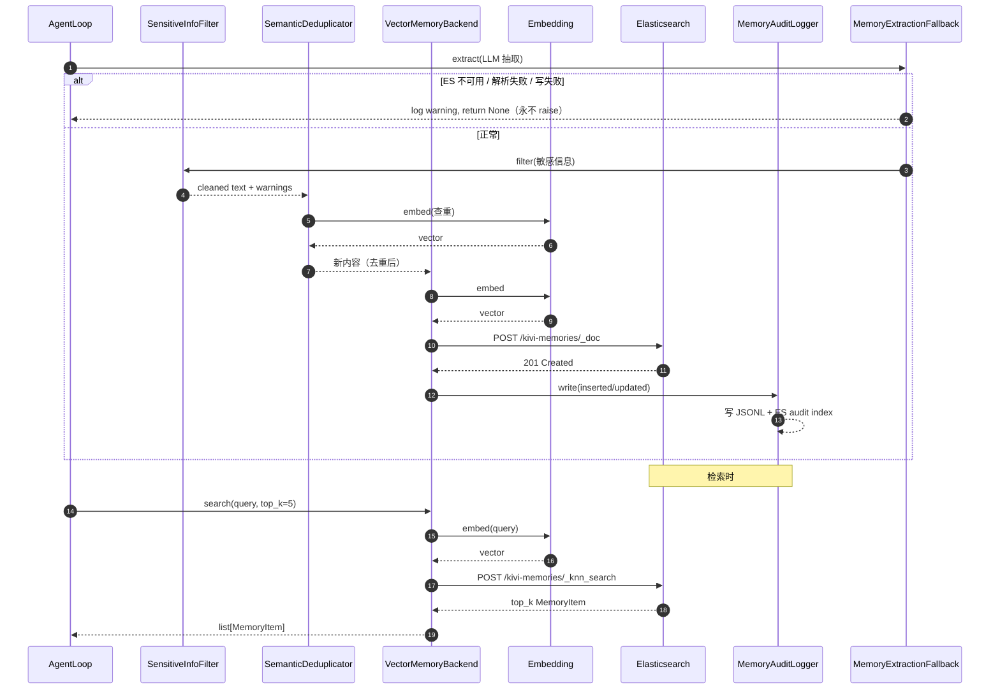
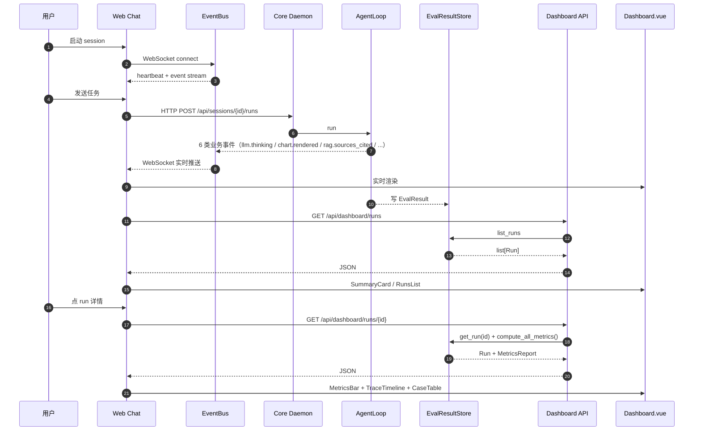

# 整体架构

> kivi-agent 是一个**自研 Agent Runtime + 业务 Agent 平台**，由 Core Daemon 驱动，多入口接入，模块化业务能力，可选向量记忆与评测体系。
> 本文档配合 [data-flow.md](data-flow.md)（数据流）和 [development/modules.md](../development/modules.md)（模块说明）一起阅读。

## 1. 一句话架构

> **用户从 CLI / TUI / Web Chat 任一入口发起任务 → Core Daemon 接收 → BusinessRouter 路由到 5 个业务 Profile 之一（或多个 + Synthesizer 汇总）→ AgentLoop 执行 LLM + Tools 循环 → 结果回写 + 事件流推送给前端 → 可选写入 Vector Memory → Eval Dashboard 跑指标。**

## 2. 整体架构图



**实线** = 当前实现；**虚线** = 可选组件（需外部服务）。

## 3. 分层职责

| 层 | 模块 | 职责 | 实现位置 |
|---|---|---|---|
| **接入层** | `kivi` / `kivi-tui` / `apps/web-chat` | 接收用户输入、渲染输出、展示事件 | `src/kivi_agent/cli/`, `src/kivi_agent/tui/`, `apps/web-chat/src/` |
| **通信层** | TCP loopback / WebSocket / HTTP REST | 协议序列化、反序列化、连接管理 | `src/kivi_agent/core/bus/`, `src/kivi_agent/gateway/` |
| **核心** | Core Daemon / EventBus / Permission / Sandbox | 守护进程、事件分发、权限审批、沙箱隔离 | `src/kivi_agent/core/` |
| **业务编排** | BusinessRouter / 5 Profile / Synthesizer | 路由决策、Profile 选择、多意图合并 | `src/kivi_agent/core/agents/builtin/business/`, `src/kivi_agent/core/agents/business_router.py`, `synthesizer.py` |
| **Agent 运行时** | AgentLoop / Subagent / Team | LLM + Tools 循环、Subagent 派生、Team 并行 | `src/kivi_agent/core/loop.py`, `core/teams/`, `core/subagent/` |
| **工具** | BaseTool / 6 业务 Tool / Skills / MCP | 工具注册、执行、权限、Skill 加载、MCP 协议 | `src/kivi_agent/core/tools/`, `core/skills/`, `core/mcp/` |
| **LLM Provider** | Anthropic / OpenAI Compat | API 调用、流式、prompt cache | `src/kivi_agent/core/llm/` |
| **记忆** | Local / Vector / Embedding | 长期记忆写入、检索、敏感过滤、去重、审计 | `src/kivi_agent/core/memory/` |
| **评测** | EvalRunner / Metrics / Dashboard | 数据集加载、批量跑、指标计算、API 暴露 | `src/kivi_agent/eval/`, `src/kivi_agent/gateway/dashboard.py` 等 |
| **Web 端** | Vue 3 + Pinia + ECharts | 实时事件展示、Dashboard 可视化、地图渲染 | `apps/web-chat/src/` |

## 4. 模块说明

### 4.1 `core/` 核心层

详见 [../development/modules.md §core](../development/modules.md)。

- **`core/app.py`**：Core Daemon 入口（`kivi-core` 命令）
- **`core/runner.py`**：AgentRunner 组装点（Provider + Bus + ToolRegistry + PermissionManager + SkillManager）
- **`core/loop.py`**：AgentLoop（LLM ↔ Tool 循环主体）
- **`core/runs.py`**：Run 生命周期管理
- **`core/session/`**：会话存储 + checkpoint
- **`core/bus/`**：EventBus + Event 联合 + Command schema（WIRE_PROTOCOL 自动生成）
- **`core/permissions/`**：PermissionPolicy + PermissionManager
- **`core/sandbox/`**：BashTool 沙箱（Seatbelt / Bubblewrap）
- **`core/hooks/`**：Hook 系统（pre/post tool call）
- **`core/compact/`**：上下文压缩 + 熔断
- **`core/filehistory/`**：FileHistory 快照 + rewind_file
- **`core/workspace/`**：Worktree 隔离
- **`core/task/`**：Task 跟踪

### 4.2 `core/agents/` Agent 体系

- **`core/agents/profile.py`**：`AgentProfile` 模型（5 扩展字段：system_prompt / allowed_tools / max_steps / category / concurrency_group）
- **`core/agents/loader.py`**：Profile 加载器（TOML → `AgentProfile`）
- **`core/agents/business_router.py`**：`BusinessRouter`（关键词路由 → `RouteDecision`）
- **`core/agents/synthesizer.py`**：`SynthesizerRunner`（多 Profile 并行 + LLM 汇总）
- **`core/agents/builtin/`**：内建 Profile（含 `business/{general,rag,web_search,database,synthesizer}.toml` 5 个）
- **`core/agents/builtin/coordinator.toml`**：协调者 Profile（只调度不编码）
- **`core/teams/`**：Team / TeammateInfo / Mailbox / TeamManager（多 Agent 团队协作）
- **`core/subagent/`**：Subagent 派生（`spawn_background_subagent`）

### 4.3 `core/business/` 业务 Tool

- **`core/business/web_search.py`**：网络搜索（Mock + 真实 Adapter 切换）
- **`core/business/rag_query.py`**：RAG 知识库查询（Mock + HTTP RagKbClient）
- **`core/business/query_database.py`**：数据库查询（Mock + SQLite / Postgres Adapter）
- **`core/business/echarts_render.py`**：ECharts 图表渲染元数据
- **`core/business/memory_save.py`**：长期记忆保存
- **`core/business/memory_recall.py`**：长期记忆检索
- **`core/business/base.py`**：`BaseBusinessTool` 抽象类

### 4.4 `core/tools/` 工具注册表

- **`core/tools/base.py`**：`BaseTool`（`name` / `description` / `input_schema` / `category` / `run`）
- **`core/tools/registry.py`**：`ToolRegistry`（`deferred` / `discovered` / `search` 机制）
- **`core/tools/executor.py`**：工具并发批次执行（`category="read"` 可并发）
- **`core/tools/builtin/`**：内建工具（bash / edit_file / read_file / glob / grep / diff / worktree / ask_user / rewind_file / file_history / tool_search 等）
- **`core/tools/categories.py`**：工具分类常量

### 4.5 `core/skills/` Skills 2.0

- **`core/skills/definition.py`**：`SkillDefinition`（双模式：description 摘要 / content 全量）
- **`core/skills/registry.py`**：`SkillRegistry` 内存索引 + 关键词搜索
- **`core/skills/loader.py`**：`SkillContentReader` 渐进式披露
- **`core/skills/install.py`**：Skill 安装（git clone + SKILL.md 校验）
- **`core/skills/executor.py`**：`ScriptExecutor` 受控执行（沙箱）
- **`core/skills/manager.py`**：`SkillManager` 整合
- **`core/skills/builtin/`**：6 个内建 Skill

### 4.6 `core/mcp/` MCP 协议

- **`core/mcp/client.py`**：MCP 客户端
- **`core/mcp/secrets.py`**：`${SECRET:NAME}` 引用语法

### 4.7 `core/memory/` 长期记忆

- **`core/memory/types.py`**：`MemoryType` / `MemoryStatus` / `MemoryImportance` 字面量
- **`core/memory/backend.py`**：`MemoryBackend` Protocol
- **`core/memory/local_backend.py`**：`LocalMemoryBackend`（Markdown 文件）
- **`core/memory/vector_backend.py`**：`VectorMemoryBackend`（ES knn_vector）
- **`core/memory/embedding/`**：`FakeEmbedding`（SHA-512 伪随机）/ `OpenAICompatEmbedding`
- **`core/memory/rerank.py`**：`BM25Reranker`（纯函数 + class 两种入口）
- **`core/memory/filter.py`**：`SensitiveInfoFilter`（7 类正则）
- **`core/memory/dedup.py`**：`SemanticDeduplicator`（语义去重）
- **`core/memory/audit.py`**：`MemoryAuditLogger`（JSONL + 路径遍历防护）
- **`core/memory/expire.py`**：`MemoryExpirer`（过期自动 archive）
- **`core/memory/fallback.py`**：`MemoryExtractionFallback`（永不 raise）
- **`core/memory/lifecycle.py`**：生命周期编排（filter → dedup → write → audit）
- **`core/memory/store.py`**：`MemoryItemStore`（统一 Local/Vector 入口）
- **`core/memory/extractor.py`**：LLM 抽取记忆

### 4.8 `core/db/` 数据库 Adapter

- **`core/db/__init__.py`**：`DatabaseAdapter` Protocol
- **`core/db/mock.py`**：`MockAdapter`（内存表）
- **`core/db/sqlite.py`**：`SQLiteAdapter`（aiosqlite）
- **`core/db/postgres.py`**：`PostgresAdapter`（asyncpg）

### 4.9 `core/rag/` RAG

- **`core/rag/types.py`**：`RagSource` / `RagSearchResult` 数据类型
- **`core/rag/client.py`**：`RagKbClient`（httpx + 健康检查 + 测试 seam）

### 4.10 `core/llm/` LLM Provider

- **`core/llm/factory.py`**：Provider 工厂（按 `llm.provider` 字段路由）
- **`core/llm/anthropic.py`**：Anthropic Provider（claude-sonnet-4-6 等）
- **`core/llm/openai_compat.py`**：OpenAI 兼容 Provider（DeepSeek / Moonshot / OpenAI）
- **`core/llm/catalog.py`**：模型上下文窗口统一目录
- **`core/llm/streaming_collector.py`**：`StreamAccumulator` 流式聚合

### 4.11 `gateway/` Web Gateway

- **`gateway/main.py`**：FastAPI app + lifespan + WebSocket 路由
- **`gateway/adapter.py`**：`RuntimeAdapter` SocketClient 桥接（`run_id → session_id` 映射）
- **`gateway/event_bridge.py`**：订阅 6 类业务事件 → WebSocket 推送
- **`gateway/heartbeat.py`**：15s 心跳
- **`gateway/replay.py`**：100 条事件缓存 + `since` 重传
- **`gateway/health.py`**：健康检查（Protocol duck typing）
- **`gateway/dashboard.py`**：Eval Dashboard API（5 端点）
- **`gateway/team_dashboard.py`**：Team Dashboard API（5 端点）
- **`gateway/coding_dashboard.py`**：Coding Dashboard API（5 端点）
- **`gateway/memory_dashboard.py`**：Memory Dashboard API（8 端点）

### 4.12 `eval/` 评测

- **`eval/dataset.py`**：`EvalDataset` / JSONL 加载
- **`eval/result.py`**：`EvalResult` / `ToolCallRecord` / `CaseEvent`
- **`eval/runner.py`**：`EvalRunner`
- **`eval/runner_executor.py`**：Runner 执行器
- **`eval/judge.py`**：`Judge`（必填 `expected_answer` + `reference_context`）
- **`eval/store.py`**：`EvalResultStore` 单例
- **`eval/team_store.py`**：Team 评测 Store
- **`eval/coding_store.py`**：Coding 评测 Store
- **`eval/metrics/`**：14 个指标（基础 7 + Team 6 + Coding 8，3 个重叠）
  - `base.py` / `task_success.py` / `route_accuracy.py` / `tool_accuracy.py` / `rag_citation.py` / `latency.py` / `token.py` / `cost.py` / `report.py`
  - `team.py`（T11 6 指标）
  - `coding.py`（T12 8 指标）
- **`eval/team/`**：`TeamCase` / `TeamRunner` / `MailboxTracker`
- **`eval/coding/`**：最小 `CodingAgent` / `diff_parser` / `models`
- **`cli/eval.py`**：`kivi-eval` CLI 入口

### 4.13 `tui/` 终端 UI

- **`tui/app.py`**：Textual App 主体（5 widget 挂载 + 业务事件轮询）
- **`tui/route_panel.py`**：路由决策面板
- **`tui/business_event_widget.py`**：业务事件 Widget
- **`tui/citation_widget.py`**：RAG 引用 Widget
- **`tui/chart_metadata_widget.py`**：图表元数据 Widget
- **`tui/synthesizer_view.py`**：Synthesizer 汇总视图（TODO 挂载）
- **`tui/permission_widgets.py`**：权限审批 Widget（拆分独立文件）
- **`tui/plan_dialog.py`**：计划模式对话框
- **`tui/ask_user_dialog.py`**：ask_user 弹窗
- **`tui/session_screen.py`**：会话选择/恢复
- **`tui/team_tree.py`**：团队树视图

### 4.14 `apps/web-chat/` Web 端

- **`apps/web-chat/src/main.ts`**：入口（Pinia + router + session API）
- **`apps/web-chat/src/App.vue`**：根组件（RouterView）
- **`apps/web-chat/src/router.ts`**：vue-router 配置
- **`apps/web-chat/src/stores/`**：Pinia stores（session / events）
- **`apps/web-chat/src/composables/`**：`useWebSocket` / `useBusinessEvents` / `useCancel` / `useErrorHandler`
- **`apps/web-chat/src/components/`**：UI 组件（MessageList / CancelButton / ConnectionStatus / ErrorBanner / SessionHeader / SessionList / RoutePanel / CitationWidget / ChartWidget / MetricsBar / SummaryCard / RunsList / TraceTimeline / CaseTable + memory/* + team/* + coding/*）
- **`apps/web-chat/src/views/`**：页面（ChatView / Dashboard / DashboardCaseDetail / DashboardRunDetail / TeamDashboard / TeamCaseDetail / TeamDashboardDetail / CodingDashboard / CodingDashboardDetail / MemoryDashboard / SessionList）
- **`apps/web-chat/src/api/`**：API 客户端（dashboard / team / coding / memory）
- **`apps/web-chat/src/types/`**：TypeScript 类型（`api.ts` 等）

## 5. 5 个核心流程

### 5.1 `agent.run` 单 Agent 任务（CLI / TUI）

```mermaid
sequenceDiagram
    autonumber
    participant U as 用户
    participant CLI as kivi
    participant Core as Core Daemon
    participant Loop as AgentLoop
    participant Perm as PermissionManager
    participant Tool as 工具
    participant LLM as LLM Provider

    U->>CLI: 发送任务"当前目录是什么 pwd"
    CLI->>Core: TCP Wire Protocol 序列化
    Core->>Loop: RunContext 注入
    Loop->>LLM: model_selected + 规划
    LLM-->>Loop: text + tool_use(pwd)
    Loop->>Perm: tool_use 检查策略
    alt ASK 策略
        Perm-->>CLI: 触发审批
        CLI->>U: 渲染审批卡片
        U-->>CLI: 同意
        CLI-->>Perm: respond(allow)
    end
    Perm-->>Loop: allow
    Loop->>Tool: 调 bash(pwd)
    Tool-->>Loop: result="/Users/..."
    Loop->>LLM: tool_result 回灌
    LLM-->>Loop: 终态 text
    Loop-->>Core: run.finished
    Core-->>CLI: 响应序列化
    CLI-->>U: 终端显示
```

### 5.2 `multi_agent` 多 Profile 业务任务



### 5.3 `eval` 评测流程



### 5.4 `memory` 长期记忆生命周期



### 5.5 `dashboard` Dashboard 端到端



## 6. 关键设计原则

### 6.1 自研 Runtime，不引入 LangGraph

- `AgentLoop` 是核心循环（LLM ↔ Tool），不依赖 LangChain `AgentExecutor` / LangGraph `StateGraph`
- `Subagent` / `Team` 是文件系统 Mailbox 协作，不依赖 LangGraph 多 actor
- 业务 Tool 是 kivi `BaseTool` 子类，不依赖 LangChain `Tool` 包装

### 6.2 业务 Tool 100% Mock 起步

- 6 个业务 Tool（`web_search` / `rag_query` / `query_database` / `echarts_render` / `memory_save` / `memory_recall`）都是 `Mock` 实现
- 真实 Adapter 通过 Protocol 抽象（`DatabaseAdapter` / `RagKbClient` / `MemoryBackend`）
- 启动时健康检查 + 失败自动降级到 Mock（`auto_fallback=true`）

### 6.3 Profile 化业务 Agent

- 5 个业务 Profile（`general` / `rag` / `web_search` / `database` / `synthesizer`）冻结于 `core/agents/builtin/business/`
- `BusinessRouter` 关键词路由 + `RouteDecision` 数据类
- 多意图并行 + `Synthesizer` 汇总

### 6.4 事件驱动 + 协议优先

- 6 类 v1 业务事件（`LlmThinkingEvent` / `ChartRenderedEvent` / `RagSourcesCitedEvent` / `FrontendToolCallRequested` / `FrontendToolCallResponded` / `RunCancelledEvent`）冻结
- EventBus pub/sub，6 类事件由 `BusinessEventHandler` 订阅聚合
- Web 端 WebSocket 实时推送 + Gateway REST 兜底
- 协议契约冻结于 `docs/contracts/v1.md`，WIRE_PROTOCOL.md 自动生成

### 6.5 记忆可降级

- Local Markdown 永远可用（无外部依赖）
- Vector (ES) 可选；不可用自动降级
- Embedding `fake` / `openai` 双模式
- 抽取失败永不阻塞主任务

### 6.6 评测可观测

- 7 基础指标 + 6 Team 指标 + 8 Coding 指标
- 5 Dashboard 端点 × 3 Dashboard = 15 端点
- 前端 5 Dashboard 视图（Trace / Metrics / Memory / Team / Coding）

## 7. 端到端 5 演示

5 个演示横跨所有核心模块：

| Demo | 涉及模块 | 入口命令 |
|---|---|---|
| 1 编程 Agent | `eval/coding/` + `eval/metrics/coding.py` | `uv run python -m demos.demo1_coding` |
| 2 RAG | `core/rag/` + `core/business/rag_query.py` | `uv run python -m demos.demo2_rag` |
| 3 数据库 | `core/db/` + `core/business/query_database.py` | `uv run python -m demos.demo3_database` |
| 4 前端地图 | `core/tools/builtin/map_load.py` + `core/agents/builtin/business/frontend_tool.toml` + `MapView.vue` | `uv run python -m demos.demo4_frontend_map` |
| 5 综合多 Agent | 全部模块 | `uv run python -m demos.demo5_multi_agent` |

详见 [docs/demo/](../demo/) 下的 5 份演示手册。

## 8. 后续阅读

- **[data-flow.md](data-flow.md)**：数据流（user input → LLM → tool → memory → response）+ 关键数据结构
- **[../development/modules.md](../development/modules.md)**：按目录分章节的模块说明 + 关键文件清单
- **[../development/contributing.md](../development/contributing.md)**：代码风格、测试规范、PR 流程
- **[../../MIGRATION.md](../../MIGRATION.md)**：已迁移 / 未迁移 / 后续计划清单
- **[../../WIRE_PROTOCOL.md](../../WIRE_PROTOCOL.md)**：IPC 协议定义（自动生成）
