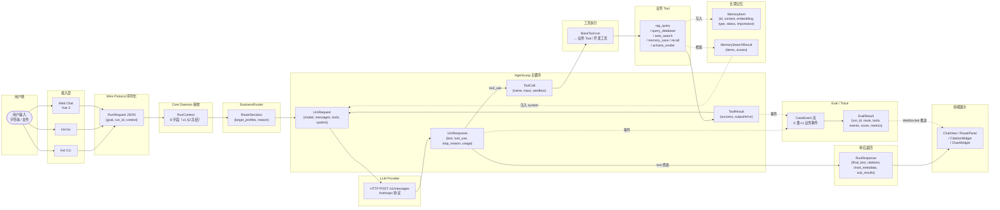
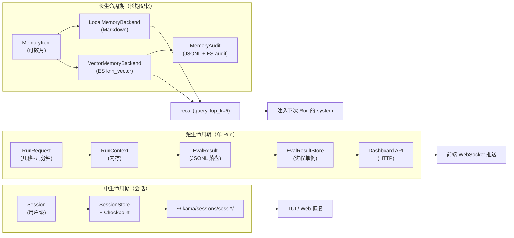
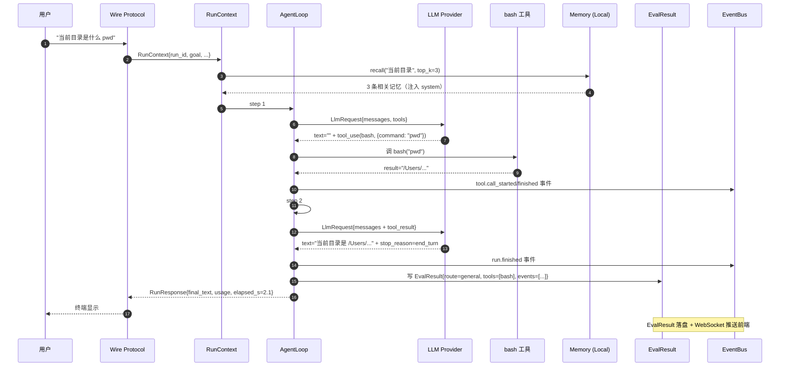

# 数据流

> kivi-agent 端到端数据流：用户输入 → LLM → 工具 → 记忆 → 响应。
> 本文档是 [architecture.md](architecture.md) 的数据视角补充，专注于**数据形状**和**流向**。

## 1. 一句话数据流

> **用户输入字符串** → Wire Protocol 序列化 → `RunContext` 注入 → `AgentLoop` 调 LLM → LLM 返回 `text` + `tool_use` 列表 → 工具执行 → `tool_result` 回灌 LLM → 终态 `text` → 同时写入 `EvalResult`（事件流）和可选 `MemoryItem` → 反序列化推回前端。

## 2. 端到端数据流图



## 3. 各阶段数据形态

### 3.1 用户输入（前端 → Core）

**CLI / TUI**：

```
"当前目录是什么 pwd"  # 纯字符串
```

**Web Chat**：

```typescript
{
  session_id: "sess-2026-07-23-001",
  goal: "对比网上关于 RAG 的最新文章和我们内部知识库",
  // 可选：附件 / context 注入
}
```

### 3.2 Wire Protocol 序列化

`RunRequest`（v1 §2 冻结字段）：

```json
{
  "schema_version": 1,
  "run_id": "run-2026-07-23-abc123",
  "session_id": "sess-2026-07-23-001",
  "user_id": "kivi",                  // 个人版不区分租户
  "goal": "当前目录是什么 pwd",
  "context": {},                       // 上下文注入
  "profile_name": "general",           // 可选，BusinessRouter 可覆盖
  "max_steps": 20
}
```

### 3.3 `RunContext`（Core 内部）

继承 `RunRequest` + 加 5 个运行时字段：

```python
class RunContext(BaseModel):
    schema_version: Literal[1] = 1
    run_id: str
    session_id: str
    user_id: str                       # 用户 ID（个人版不区分租户）
    goal: str
    context: dict[str, Any]
    profile_name: str                  # BusinessRouter 决策后填入
    max_steps: int

    # 运行时字段
    provider: LLMProvider              # 注入（不序列化）
    bus: EventBus
    tool_registry: ToolRegistry
    permission_manager: PermissionManager
```

### 3.4 `RouteDecision`（BusinessRouter 输出）

```python
class RouteDecision(BaseModel):
    target_profiles: list[str]         # e.g. ["rag", "web_search", "synthesizer"]
    reason: str                        # 路由理由（"多意图：知识库+联网"）
    priority_order: list[str]          # ["rag", "web_search"]（不含 synthesizer）
```

### 3.5 `LlmRequest` / `LlmResponse`

```python
class LlmRequest(BaseModel):
    model: str                         # "claude-sonnet-4-6" / "deepseek-v4-pro"
    messages: list[Message]            # 含 system / user / assistant / tool_result
    tools: list[ToolSpec]              # BaseTool.description + input_schema
    max_tokens: int
    temperature: float = 1.0

class LlmResponse(BaseModel):
    text: str | None                   # 文本部分
    tool_use: list[ToolUseBlock]       # 工具调用部分
    stop_reason: Literal["end_turn", "tool_use", "max_tokens"]
    usage: Usage                       # input / output / cache_read / cache_creation

class Usage(BaseModel):
    input_tokens: int
    output_tokens: int
    cache_read_input_tokens: int
    cache_creation_input_tokens: int
```

### 3.6 `ToolCall` / `ToolResult`

```python
class ToolCallRecord(BaseModel):
    """v1 §5.2.1 三个 tool 事件的合并视图。"""
    tool_name: str
    started_at: str                    # ISO 8601
    finished_at: str | None
    success: bool = True
    error: str | None
    elapsed_ms: int | None

class ToolUseBlock(BaseModel):
    """LLM 输出的 tool_use 块。"""
    id: str                            # "call_00_abc123"
    name: str                          # "bash" / "rag_query" / ...
    input: dict[str, Any]              # 工具入参（按 input_schema 校验）

class ToolResultBlock(BaseModel):
    """tool_result 回灌 LLM。"""
    tool_use_id: str                   # 对应 ToolUseBlock.id
    content: str | list[dict[str, Any]]
    is_error: bool = False
```

### 3.7 `MemoryItem` / `MemorySearchResult`

```python
class MemoryItem(BaseModel):
    id: str
    content: str
    type: Literal["user", "feedback", "project", "reference", "task"]
    status: Literal["active", "pending", "archived", "expired"]
    importance: float                  # 0.0-1.0
    embedding: list[float] | None      # 维度 = config.embedding.dims
    metadata: dict[str, Any]
    created_at: str
    updated_at: str
    expires_at: str | None

class MemorySearchResult(BaseModel):
    items: list[MemoryItem]
    scores: list[float]                # 相似度
    backend: Literal["local", "vector"]
    query: str
```

### 3.8 `EvalResult` / `CaseEvent`

```python
class EvalResult(BaseModel):
    """单 case 跑完后的全量信息。"""
    case_id: str
    run_id: str
    route_decision: RouteDecision
    tool_calls: list[ToolCallRecord]
    events: list[CaseEvent]
    final_text: str
    usage: Usage
    judge_score: float | None          # 0.0-1.0
    judge_reasoning: str | None
    started_at: str
    finished_at: str

class CaseEvent(BaseModel):
    """v1 §5.2.1 6 业务事件 + tool 3 事件。"""
    type: str
    ts: str
    data: dict[str, Any]
```

**6 类 v1 业务事件**（v1 §5.2.1 冻结）：

| 事件 | data 字段 |
|---|---|
| `llm.thinking` | `{run_id, text_chunk}` |
| `rag.sources_cited` | `{run_id, sources: list[dict]}` |
| `chart.rendered` | `{run_id, chart_id, option_dict: dict}` |
| `frontend_tool.call_requested` | `{run_id, request_id, tool, payload}` |
| `frontend_tool.call_responded` | `{run_id, request_id, status, result}` |
| `run.cancelled` | `{run_id, reason}` |

**3 类 tool 事件**：

| 事件 | data 字段 |
|---|---|
| `tool.call_started` | `{run_id, call_id, name, input}` |
| `tool.call_finished` | `{run_id, call_id, output, elapsed_ms}` |
| `tool.call_failed` | `{run_id, call_id, error}` |

### 3.9 `RunResponse`（Core → 前端）

```python
class RunResponse(BaseModel):
    run_id: str
    final_text: str
    citations: list[RagSource]         # RAG 引用
    chart_metadata: list[ChartMetadata]  # 图表元数据
    sub_results: list[SubResult]       # 多 Profile 结果
    usage: Usage
    elapsed_s: float
    status: Literal["success", "failed", "cancelled"]
    error: str | None
```

## 4. 关键数据转换点

### 4.1 Wire Protocol ↔ RunContext

CLI / TUI 用 TCP loopback + JSON Line 协议：

```
[kivi] → "{\"type\":\"run.started\",...}\n" → [kivi-core]
[kivi-core] → "{\"type\":\"run.finished\",\"data\":{...}}\n" → [kivi]
```

Web Chat 用 HTTP REST + WebSocket：

```
[Web] → POST /api/sessions/{id}/runs {goal: "..."} → [Gateway]
[Gateway] → WebSocket 推送 6 类业务事件 → [Web]
```

**映射表**（`RuntimeAdapter` / `WebSocketBridge`）：

| Wire Protocol | Core 内部 |
|---|---|
| `run.started` event | `RunContext.run_id` + `started_at` |
| `tool.call_started` | `ToolCallRecord.started_at` |
| `tool.call_finished` | `ToolCallRecord.finished_at` + `success` |
| `tool.call_failed` | `ToolCallRecord.finished_at` + `error` |
| `rag.sources_cited` | `RunResponse.citations` |
| `chart.rendered` | `RunResponse.chart_metadata` |
| `run.cancelled` | `RunResponse.status = "cancelled"` |

### 4.2 LLM Provider ↔ AgentLoop

`anthropic` Python SDK / `openai` SDK 是底层库，`AgentLoop` 通过 `Provider.call()` 抽象：

```python
class Provider(Protocol):
    async def call(self, req: LlmRequest) -> LlmResponse: ...
    async def stream(self, req: LlmRequest) -> AsyncIterator[LlmChunk]: ...
```

`StreamAccumulator` 统一流式增量聚合（Anthropic / OpenAI 两边都改用它）。

### 4.3 Tool 入参与 schema

每个 `BaseTool` 声明 `input_schema: dict`（JSON Schema）：

```python
class RagQueryTool(BaseBusinessTool):
    name = "rag_query"
    description = "查询知识库"
    input_schema = {
        "type": "object",
        "properties": {
            "query": {"type": "string", "description": "查询问题"},
            "top_k": {"type": "integer", "default": 5, "minimum": 1, "maximum": 20}
        },
        "required": ["query"]
    }
```

LLM 的 `tool_use.input` 自动按 `input_schema` 校验；校验失败回灌 `tool_result.is_error=True`。

### 4.4 Memory 注入

`MemoryRecaller.recall(query, top_k=5)` → 检索 → 拼接到 system prompt：

```python
async def recall_and_inject(run_context: RunContext, query: str) -> None:
    """检索相关记忆并注入到 run_context.context['memories']。"""
    result = await memory_recaller.recall(query, top_k=5)
    run_context.context["memories"] = [
        {"content": m.content, "importance": m.importance}
        for m in result.items
    ]
```

下游 `AgentLoop._build_system_prompt` 读取并渲染到 system message。

### 4.5 Event 流 → EvalResult

`BusinessEventHandler` 订阅 6 类业务事件，按 `run_id` 聚合：

```python
class BusinessEventHandler:
    """v1 §5.2.1 6 类业务事件聚合。"""

    def __init__(self) -> None:
        self._log: dict[str, BusinessEventLog] = {}

    def on_llm_thinking(self, evt: LlmThinkingEvent) -> None: ...
    def on_rag_sources_cited(self, evt: RagSourcesCitedEvent) -> None: ...
    def on_chart_rendered(self, evt: ChartRenderedEvent) -> None: ...
    def on_frontend_tool_requested(self, evt: FrontendToolCallRequested) -> None: ...
    def on_frontend_tool_responded(self, evt: FrontendToolCallResponded) -> None: ...
    def on_run_cancelled(self, evt: RunCancelledEvent) -> None: ...
```

事件按 `parent_run_id` + `sub_run_id` 维度聚合到 `BusinessEventLog`，最终落到 `EvalResult.events`。

## 5. 关键数据结构速查

| 数据结构 | 文件 | 说明 |
|---|---|---|
| `RunContext` | `core/runner/run_context.py` | v1 §2 冻结 8 字段 |
| `AgentProfile` | `core/agents/profile.py` | v1 §3 冻结 5 扩展字段 |
| `MemoryItem` | `core/memory/types.py` | 长期记忆条目 |
| `MemoryType` / `MemoryStatus` | `core/memory/types.py` | Literal 类型 |
| `RagSource` / `RagSearchResult` | `core/rag/types.py` | RAG 数据 |
| `EvalResult` / `ToolCallRecord` / `CaseEvent` | `eval/result.py` | 评测结果 |
| `TeamCase` / `TeamEvalResult` / `MemberOutcome` / `DelegationStep` | `eval/team/models.py` | T11 数据 |
| `EvalDataset` | `eval/dataset.py` | JSONL 数据集 |
| `RouteDecision` | `core/agents/business_router.py` | 路由决策 |
| `SubResult` / `SynthesizedResult` | `core/agents/synthesizer.py` | 多 Profile 合并 |
| `LlmRequest` / `LlmResponse` / `Usage` | `core/llm/factory.py` | LLM 协议 |
| `ToolUseBlock` / `ToolResultBlock` | `core/llm/anthropic.py` 等 | 工具调用块 |
| 6 类 v1 业务事件 | `core/bus/events.py` | v1 §5.2.1 冻结 |
| `SessionCancel` 命令组 | `core/bus/commands.py` | v1 §5.2.2 冻结 |

## 6. 数据生命周期



**短**（EvalResult）：每个 Run 跑完落 `.jsonl`，Dashboard API 立即可查。

**中**（Session）：用户跨 Run 保留上下文，checkpoint 存中间态。

**长**（Memory）：跨会话跨 Run，user/feedback/project/reference/task 5 类，按 query 召回。

## 7. 端到端示例：编程 Agent 一次完整 Run



**对应数据形态**：

| 阶段 | 数据 |
|---|---|
| 用户输入 | `"当前目录是什么 pwd"` |
| Wire Protocol | `RunRequest{run_id, session_id, goal, schema_version:1}` |
| RunContext | 8 字段 + 5 运行时注入 |
| LlmRequest step 1 | `{model, messages: [system(含记忆), user(goal)], tools: [bash, ...]}` |
| LlmResponse step 1 | `{text: "", tool_use: [{id, name: "bash", input: {command: "pwd"}}]}` |
| ToolResult | `"{success: true, output: "/Users/..."}` |
| LlmResponse step 2 | `{text: "当前目录是 /Users/...", stop_reason: "end_turn"}` |
| CaseEvent 流 | 6 业务事件 + 3 tool 事件 = 9 事件 |
| EvalResult | `{route: general, tools: [bash_record], events: [...], usage: {input: 135, output: 63, cache_read: 3584}, judge_score: 1.0}` |
| RunResponse | `{final_text, usage, elapsed_s: 2.1, status: success}` |

## 8. 后续阅读

- **[architecture.md](architecture.md)**：整体架构 + 模块说明 + 5 核心流程 sequence
- **[../development/modules.md](../development/modules.md)**：按目录分章节的模块说明
- **[../development/contributing.md](../development/contributing.md)**：代码风格、测试规范
- **[../../MIGRATION.md](../../MIGRATION.md)**：已迁移 / 未迁移 / 后续计划
- **[../../WIRE_PROTOCOL.md](../../WIRE_PROTOCOL.md)**：IPC 协议完整定义（自动生成）
