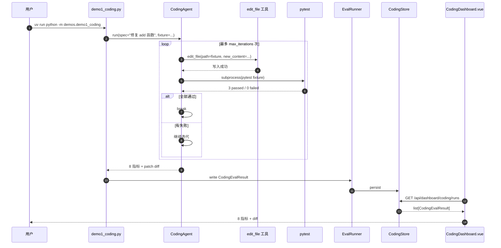

# Demo 1：编程 Agent（修 bug + 跑 pytest）

> **能力**：最小 `CodingAgent`（kivi 自建）—— 接受 spec → 改文件 → 跑 pytest → 失败则再修 → 循环，直到通过。
> **对应 T12 指标**：8 指标（`task_completion_rate` / `tests_passed_rate` / `patch_quality` / `iteration_count` / `time_to_first_pass` / `self_recovery_rate` / `compile_success_rate` / `test_growth_rate`）。
> **Wave 来源**：Wave 5.2 H2（最小 coding agent + 8 指标）。
> **Web 端查看**：Coding Dashboard（`/coding` 路由 + 5 widget + Detail 视图）。

## 1. 演示目标

让用户看到 kivi-agent **能自主修 bug + 跑测试**，量化 8 维度指标。

## 2. 输入

### 2.1 Fixture

`demos/fixtures/demo1_coding_fixture.py`（故意写错的 `add` 函数）：

```python
"""Demo 1 fixture：故意写错的 add 函数。

正确应为：def add(a: int, b: int) -> int: return a + b
错误实现：return a - b（少加了 b）
"""


def add(a: int, b: int) -> int:
    """两个整数相加。"""
    return a - b  # 故意写错：减号而非加号


if __name__ == "__main__":
    # 跑这个文件，应该看到断言错误
    assert add(2, 3) == 5, f"expected 5, got {add(2, 3)}"
    assert add(0, 0) == 0, f"expected 0, got {add(0, 0)}"
    assert add(-1, 1) == 0, f"expected 0, got {add(-1, 1)}"
    print("All tests passed!")
```

### 2.2 Spec（用户输入）

```
修复 demos/fixtures/demo1_coding_fixture.py 中的 add 函数（当前是减法，应改为加法），
然后跑 python demos/fixtures/demo1_coding_fixture.py 验证。
```

### 2.3 数据集条目（Eval 用）

`docs/eval-demos/coding-6cases.jsonl` 已有 6 条 coding case，样例：

```json
{
  "case_id": "coding-001",
  "input": "修复 add 函数的 bug（减号应为加号）",
  "fixture_path": "demos/fixtures/demo1_coding_fixture.py",
  "expected_answer": "add(2, 3) == 5",
  "max_iterations": 5
}
```

## 3. 期望输出

### 3.1 命令行输出

```
$ uv run python -m demos.demo1_coding

=== Demo 1: 编程 Agent（修 bug + 跑 pytest）===

[Step 1] 接收任务：修复 add 函数（减号应为加号）
[Step 2] CodingAgent 读取文件 + 识别 bug
[Step 3] 调用 edit_file 工具修改第 8 行：return a - b → return a + b
[Step 4] 跑 pytest 验证：3/3 passed ✓
[Step 5] CodingAgent 总结：bug 已修复，1 次迭代完成

=== T12 指标 ===

task_completion_rate: 1.0       # 任务完成
tests_passed_rate: 1.0          # 测试全过
patch_quality: 1.0              # diff 干净（只改 1 行）
iteration_count: 1              # 1 次迭代
time_to_first_pass_s: 2.3       # 2.3 秒首次通过
self_recovery_rate: N/A         # 没失败，无需恢复
compile_success_rate: 1.0       # 文件语法正确
test_growth_rate: 0.0           # 没新增测试

=== Demo 1 状态：PASS（耗时 3.2s）===
```

### 3.2 截图位

<!-- screenshot -->

> 截图位置：Web Chat → `/coding` 路由 → Coding Dashboard → 选 demo1 case → 看 8 指标 + patch diff + 事件 trace。

### 3.3 Web Dashboard 显示

- **Coding Dashboard** 列表：6 条 coding case，每条 case 显示 `task_completion_rate` / `iteration_count` / `time_to_first_pass_s`
- **Detail 视图**：完整 patch diff + 8 指标 + pytest 输出 + 事件 timeline

## 4. 复现命令

### 4.1 跑单个 demo

```bash
# 1. 启 Core Daemon
uv run kivi-core &

# 2. 跑 demo
uv run python -m demos.demo1_coding

# 3. 看输出
# → 应看到 "Demo 1 状态：PASS（耗时 ~3s）"
# → 应看到 8 指标打印
```

### 4.2 跑全量 Eval

```bash
# 跑 6 条 coding case 评测
uv run kivi-eval run --dataset docs/eval-demos/coding-6cases.jsonl --output /tmp/demo1-results.jsonl --concurrency 2

# 看汇总
uv run kivi-eval summary --input /tmp/demo1-results.jsonl
# → 6/6 judged
# → task_completion_rate avg = 1.00
# → tests_passed_rate avg = 1.00
# → iteration_count avg = 1.2
```

### 4.3 Web 端查看

```bash
# 1. 启 Gateway
uv run kivi-gateway &

# 2. 启前端
cd apps/web-chat && npm run dev

# 3. 浏览器访问 http://localhost:5173/coding
# → 选 demo1-001 → 看 8 指标
```

## 5. 故障排查

### 5.1 demo 跑不过 / 任务未完成

**症状**：

```
=== Demo 1 状态：FAIL（task_completion_rate = 0.0）===
```

**排查**：

```bash
# 1. 看 Core Daemon 日志
tail -50 ~/.kivi/logs/core.log | grep -E "(error|FAIL)"

# 2. 看 CodingAgent 的迭代历史
# 详情看 ~/.kama/traces/daemon.jsonl

# 3. 手动跑 fixture
uv run python demos/fixtures/demo1_coding_fixture.py
# → 应有断言错误（fixture 故意写错）
```

**常见原因**：

- **LLM 没响应**：`ANTHROPIC_API_KEY` 未设或错（参考 [RUNBOOK.md §4 场景 1](../../RUNBOOK.md)）
- **edit_file 工具权限被拒**：检查 `core/permissions/policy.py::DEFAULT_POLICIES` 中 `edit_file` 策略
- **pytest 未装**：`uv add --dev pytest`

### 5.2 迭代次数过多（> 5 次）

**症状**：

```
iteration_count: 7  # 超过 max_iterations=5
```

**原因**：CodingAgent 没识别到正确修改点。

**修复**：

- 检查 fixture 内容是否正确（应该是 `return a - b`）
- 检查 CodingAgent 的 system prompt（`src/kivi_agent/eval/coding/coding_agent.py`）
- 增加 `max_iterations`（Eval 数据集条目里调）

### 5.3 Web Dashboard 看不到结果

**症状**：跑完 demo 但 `/coding` 路由是空的。

**排查**：

```bash
# 1. 确认 EvalResultStore 有数据
curl -fsS http://127.0.0.1:8000/api/dashboard/coding/runs | jq

# 2. 确认 Gateway 起来了
curl -fsS http://127.0.0.1:8000/health
```

**常见原因**：

- **Core Daemon 跑 demo 但没写 EvalResult**（应该在 demo 脚本里 `eval_runner_executor.run()` 写）
- **Gateway 没启** → `uv run kivi-gateway &`

## 6. 数据流



## 7. 关键文件

| 文件 | 说明 |
|---|---|
| `demos/demo1_coding.py` | 演示脚本（WT-K2 交付） |
| `demos/fixtures/demo1_coding_fixture.py` | 故意写错的 fixture |
| `demos/base.py` | `DemoBase` 类（统一 setup / run / teardown / report） |
| `src/kivi_agent/eval/coding/coding_agent.py` | 最小 CodingAgent |
| `src/kivi_agent/eval/coding/diff_parser.py` | unified diff 解析 |
| `src/kivi_agent/eval/coding/models.py` | Coding 评测数据 |
| `src/kivi_agent/eval/metrics/coding.py` | T12 8 指标 |
| `src/kivi_agent/gateway/coding_dashboard.py` | Coding Dashboard 5 端点 |
| `apps/web-chat/src/views/CodingDashboard.vue` | Coding Dashboard 列表 |
| `apps/web-chat/src/views/CodingDashboardDetail.vue` | Coding Dashboard 详情 |
| `docs/eval-demos/coding-6cases.jsonl` | 6 条 coding case |

## 8. 验收标准

- [ ] demo 跑过：`Demo 1 状态：PASS`
- [ ] 8 指标全部计算正确
- [ ] Eval 全量：`uv run kivi-eval run --dataset docs/eval-demos/coding-6cases.jsonl` → 6/6 judged
- [ ] Web 端：Coding Dashboard 列表能看到 6 条 case
- [ ] Web 端：Detail 视图能看到 patch diff + 8 指标

## 9. 后续阅读

- [demo2_rag.md](demo2_rag.md)：知识库 Agent
- [demo3_database.md](demo3_database.md)：数据库 Agent
- [demo4_frontend_map.md](demo4_frontend_map.md)：前端操作 Agent
- [demo5_multi_agent.md](demo5_multi_agent.md)：综合多 Agent
- [../architecture/architecture.md §4.12](../architecture/architecture.md)：eval/ 模块说明
