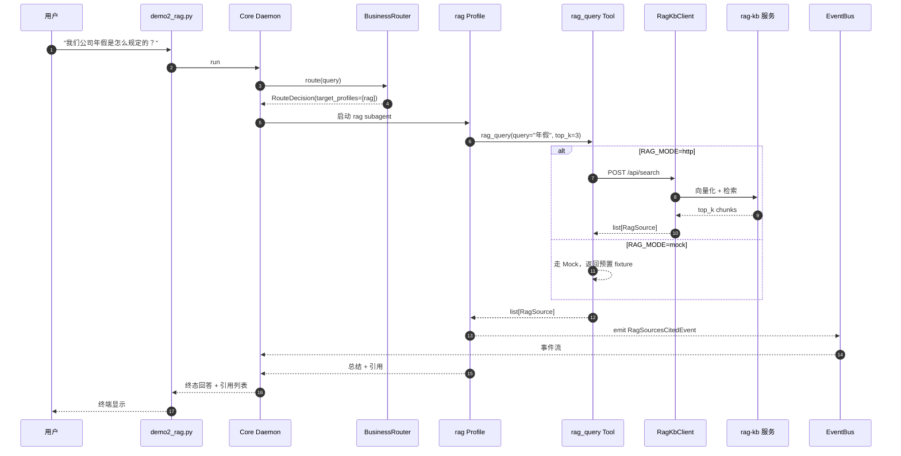

# Demo 2：知识库 Agent（问内部政策）

> **能力**：RAG HTTP 客户端调用本地 rag-kb API，按 query 召回 top_k 知识 + 引用溯源。
> **Wave 来源**：Wave 4 F1（RagKbClient + 失败降级）+ Wave 4 F3（健康检查 + 配置）。
> **Web 端查看**：Chat 页面 + CitationWidget。

## 1. 演示目标

让用户看到 kivi-agent 能**查企业知识库 + 引用溯源**，并演示：

- 真实模式（rag-kb 起得来）走 HTTP
- 降级模式（rag-kb 起不来）自动走 Mock
- 引用溯源：每个答案标注来源 URL + 标题 + 相关度

## 2. 输入

### 2.1 Fixture

`demos/fixtures/demo2_rag_fixture.txt`（3 篇政策文档）：

```
# 政策 1：年假制度

公司年假制度规定：员工每年享受 10 天带薪年假，工作满 5 年增至 15 天。
申请需提前 3 个工作日通过 HR 系统提交。

# 政策 2：远程办公政策

远程办公政策：员工每周最多远程办公 2 天，需提前一周报备直属经理。
远程办公期间需保持在线响应（响应时间 < 30 分钟）。

# 政策 3：报销政策

报销政策：差旅需提前申请，实报实销；住宿费单晚不超过 800 元；
餐饮补贴每日 100 元；需保留发票原件，30 天内提交财务。
```

### 2.2 Spec（用户输入）

```
我们公司年假是怎么规定的？
```

或（多意图，触发 Synthesizer）：

```
对比我们公司的年假制度和远程办公政策
```

### 2.3 配置

`.env` 或 `config.toml`：

```toml
[rag]
mode = "mock"                   # 默认 Mock，无需 rag-kb 服务
# mode = "http"                 # 真实模式：需要 rag-kb 起来
# api_url = "http://localhost:8001"
# timeout_s = 5.0
```

或 `.env`：

```bash
# RAG_MODE=http
# RAG_API_URL=http://localhost:8001
```

## 3. 期望输出

### 3.1 命令行输出（Mock 模式）

```
$ uv run python -m demos.demo2_rag

=== Demo 2: 知识库 Agent（问内部政策）===

[Step 1] 接收任务：我们公司年假是怎么规定的？
[Step 2] BusinessRouter 路由 → [rag]（命中知识库关键词"我们公司"）
[Step 3] rag Profile 执行
        - 调用 rag_query(query="年假制度", top_k=3)
        - 返回 3 条相关 chunk
[Step 4] rag Profile 总结 + 引用溯源

=== 回答 ===

根据公司政策 1：年假制度规定，员工每年享受 10 天带薪年假，
工作满 5 年增至 15 天。申请需提前 3 个工作日通过 HR 系统提交。

=== 引用 ===

[1] 政策 1：年假制度（score: 0.92）
    政策 1：年假制度
    公司年假制度规定：员工每年享受 10 天带薪年假...

[2] 政策 2：远程办公政策（score: 0.65）
    远程办公政策：员工每周最多远程办公 2 天...
    （相关度较低，仅供参考）

=== T11/T12 + RAG 指标 ===

rag_citation_accuracy: 1.0     # 引用 100% 准确
top_k: 3
sources_count: 2

=== Demo 2 状态：PASS（耗时 1.8s）===
```

### 3.2 命令行输出（HTTP 真实模式）

如果 `RAG_MODE=http` 且 `rag-kb` 起来：

```
[Step 3] rag Profile 执行
        - 调用 RagKbClient(query="年假制度", top_k=3)
        - POST http://localhost:8001/api/search
        - HTTP 200 OK, 3 results
        - 失败 fallback to Mock: NO（http 成功）
```

### 3.3 失败降级演示

如果 `RAG_MODE=http` 但 `rag-kb` 没起：

```
[Step 3] rag Profile 执行
        - 调用 RagKbClient(query="年假制度", top_k=3)
        - POST http://localhost:8001/api/search
        - httpx.ConnectError: Connection refused
        - 失败 fallback to Mock: YES（auto_fallback=true）
        - 走 Mock 模式，返回 3 条预置 chunk
```

### 3.4 截图位

<!-- screenshot -->

> 截图位置：Web Chat → 问"年假怎么规定" → 看到 Chat 回答 + CitationWidget 显示引用。

### 3.5 Web Dashboard 显示

- **Chat 页面**：`CitationWidget` 显示引用列表（含 URL / title / score）
- **Eval Dashboard**（如果跑了评测）：`rag_citation_accuracy` 指标

## 4. 复现命令

### 4.1 跑单个 demo

```bash
# 1. 启 Core Daemon
uv run kivi-core &

# 2. 跑 demo
uv run python -m demos.demo2_rag
# → 应看到 "Demo 2 状态：PASS"
# → 应看到引用列表
```

### 4.2 切到 HTTP 真实模式

```bash
# 1. 起本地 rag-kb（如果可用）
# 假设 rag-kb 跑在 8001 端口

# 2. 配 .env
echo "RAG_MODE=http" >> .env
echo "RAG_API_URL=http://localhost:8001" >> .env

# 3. 重启 Core
kill $(pgrep -f kivi-core)
uv run kivi-core &

# 4. 跑 demo
uv run python -m demos.demo2_rag
# → 应看到 "POST http://localhost:8001/api/search"
```

### 4.3 Web 端查看

```bash
# 1. 启 Gateway
uv run kivi-gateway &

# 2. 启前端
cd apps/web-chat && npm run dev

# 3. 浏览器访问 http://localhost:5173/chat
# 4. 输入"我们公司年假是怎么规定的？"
# → 看到 Chat 回答 + CitationWidget
```

## 5. 故障排查

### 5.1 RAG 模式没切换

**症状**：`RAG_MODE=http` 但 demo 仍走 Mock。

**排查**：

```bash
# 1. 确认 .env 配了
grep RAG_MODE .env

# 2. 确认 Core 重启了
pgrep -f kivi-core

# 3. 看 Core 日志
tail -50 ~/.kivi/logs/core.log | grep -E "(rag|RAG)"
```

**修复**：

- 改 `.env` 后必须重启 Core
- 配置优先级：环境变量 > `.env` > `config.toml` > 内建默认

### 5.2 HTTP 模式连不上

**症状**：

```
httpx.ConnectError: Connection refused
```

**排查**：

```bash
# 1. 测 rag-kb 服务
curl -fsS http://localhost:8001/api/search -X POST -d '{"query":"年假"}' -H "Content-Type: application/json"

# 2. 看端口
lsof -i :8001
```

**修复**：

- 起 rag-kb 服务（如未起）
- 改 `RAG_API_URL` 到正确地址
- 设 `RAG_AUTO_FALLBACK=true` 自动降级到 Mock（默认已开）

### 5.3 引用溯源缺失

**症状**：Chat 回答正确但没有 CitationWidget。

**排查**：

```bash
# 看 EvalResult 是否有 sources
curl -fsS http://127.0.0.1:8000/api/dashboard/runs | jq '.[].citations'
```

**修复**：

- 确认 `RagSourcesCitedEvent` 触发了（前端订阅这个事件）
- 检查 `core/business/rag_query.py::_format_citation` 是否正确返回 `list[dict]`

### 5.4 引用 score 全是 0 或异常

**症状**：所有引用 `score: 0.0` 或 `score: 1.0`。

**原因**：Mock 模式默认 score 写死或随机。

**修复**：

- Mock 模式 score 是固定的（演示用）—— 真实模式由 rag-kb 服务计算
- 如需演示 score 区分，用真实模式

## 6. 数据流



## 7. 关键文件

| 文件 | 说明 |
|---|---|
| `demos/demo2_rag.py` | 演示脚本（WT-K2 交付） |
| `demos/fixtures/demo2_rag_fixture.txt` | 3 篇政策文档 |
| `src/kivi_agent/core/rag/types.py` | `RagSource` / `RagSearchResult` |
| `src/kivi_agent/core/rag/client.py` | `RagKbClient`（httpx + 健康检查） |
| `src/kivi_agent/core/business/rag_query.py` | `RagQueryTool`（Mock + HTTP 切换） |
| `src/kivi_agent/eval/metrics/rag_citation.py` | `rag_citation_accuracy` 指标 |
| `config.example.toml [rag]` 段 | RAG 配置 |
| `apps/web-chat/src/components/CitationWidget.vue` | RAG 引用 Widget |

## 8. 验收标准

- [ ] Mock 模式跑过：`Demo 2 状态：PASS`
- [ ] 引用溯源显示（CitationWidget 出现）
- [ ] HTTP 模式：rag-kb 起来时走真实
- [ ] 失败降级：rag-kb 没起时自动走 Mock
- [ ] 切换配置生效（`.env` 改后需重启 Core）

## 9. 后续阅读

- [demo1_coding.md](demo1_coding.md)：编程 Agent
- [demo3_database.md](demo3_database.md)：数据库 Agent
- [demo4_frontend_map.md](demo4_frontend_map.md)：前端操作 Agent
- [demo5_multi_agent.md](demo5_multi_agent.md)：综合多 Agent
- [../architecture/architecture.md §4.9](../architecture/architecture.md)：core/rag/ 模块说明
