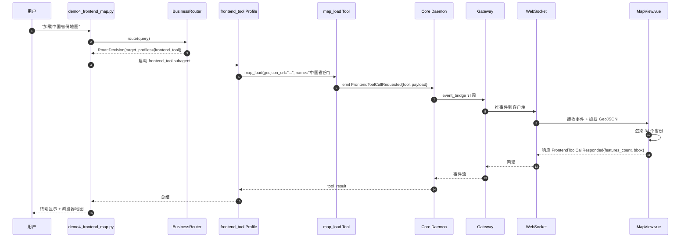

# Demo 4：前端操作 Agent（加载 GeoJSON 地图）

> **能力**：找公开 GeoJSON URL → 加载地图 → 通过 WebSocket 推 `map.geojson_loaded` 事件 → 前端 `MapView.vue` 渲染。
> **Wave 来源**：Wave 7 K2 demo 4 全新做的 `MapLoadTool` + `frontend_tool` 业务 Profile + `MapView.vue`。
> **Web 端查看**：Chat 页面 + MapView 组件（vue3-openlayers 或 Leaflet）。

## 1. 演示目标

让用户看到 kivi-agent 能**做前端操作**（找 GeoJSON + 加载地图），并演示：

- `MapLoadTool` 通过 `FrontendToolCallRequested` 事件请求前端操作
- 前端 `MapView.vue` 接收事件 + 渲染 GeoJSON
- 前端响应后 `FrontendToolCallResponded` 事件回灌给 Agent

> **状态**：**demo 4 是 Wave 7 可选验收项**（如果时间不够允许 demo 1-3-5 通过验收）。本演示依赖 WT-K2 完整实现。

## 2. 输入

### 2.1 Fixture

`demos/fixtures/demo4_geojson_fixture.json`（3 个公开 GeoJSON URL）：

```json
{
  "fixtures": [
    {
      "name": "中国省份边界",
      "url": "https://geo.datav.aliyun.com/areas_v3/bound/100000_full.json",
      "description": "中国 34 个省份 GeoJSON 多边形",
      "expected_features": 34
    },
    {
      "name": "北京市边界",
      "url": "https://geo.datav.aliyun.com/areas_v3/bound/110000_full.json",
      "description": "北京市 16 个区 GeoJSON 多边形",
      "expected_features": 16
    },
    {
      "name": "上海市边界",
      "url": "https://geo.datav.aliyun.com/areas_v3/bound/310000_full.json",
      "description": "上海市 16 个区 GeoJSON 多边形",
      "expected_features": 16
    }
  ]
}
```

### 2.2 Spec（用户输入）

```
加载中国省份地图
```

或（更具体）：

```
加载北京市边界的 GeoJSON 并显示在地图上
```

### 2.3 业务 Profile

`src/kivi_agent/core/agents/builtin/business/frontend_tool.toml`：

```toml
name = "frontend_tool"
description = "前端操作 Agent：找公开 GeoJSON / 加载地图 / 前端 UI 操作"
system_prompt = """
你是前端操作 Agent。职责：
1. 接收用户关于地图 / UI 的请求
2. 调用 map_load 工具加载 GeoJSON
3. 通过 WebSocket 推 map.geojson_loaded 事件给前端
4. 等待前端响应（FrontendToolCallResponded）
5. 汇报加载结果

原则：
- 不编造 URL，必须用 fixture 或真实公开 URL
- 必须等前端响应后再汇报
- 失败时清晰说明原因
"""
allowed_tools = ["map_load"]
max_steps = 10
category = "read"
concurrency_group = "business_frontend"
```

## 3. 期望输出

### 3.1 命令行输出

```
$ uv run python -m demos.demo4_frontend_map

=== Demo 4: 前端操作 Agent（加载 GeoJSON 地图）===

[Step 1] 接收任务：加载中国省份地图
[Step 2] BusinessRouter 路由 → [frontend_tool]
        （命中"地图""加载"关键词；或 frontend_tool 显式声明）
[Step 3] frontend_tool Profile 执行
        - LLM 选择 fixture：fixture[0]（中国省份边界）
        - 调用 map_load(geojson_url="https://geo.datav.aliyun.com/...")
        - 发出 FrontendToolCallRequested{tool="map_load", payload={url, name}}
[Step 4] 前端 MapView.vue 接收事件 + 渲染 GeoJSON
        - 加载 34 个 features
        - 计算 bbox：[73, 18, 135, 53]
        - 地图居中 + 缩放到合适级别
[Step 5] 前端响应 FrontendToolCallResponded{status="success", result={features_count, bbox}}
[Step 6] Agent 收到响应 + 汇报

=== 回答 ===

已加载中国省份地图：
- 数据源：https://geo.datav.aliyun.com/areas_v3/bound/100000_full.json
- 包含 34 个省份多边形
- 地图 bbox：[73, 18, 135, 53]（经度 73-135，纬度 18-53）

地图已在 Web 端渲染，请打开 http://localhost:5173/chat 查看。

=== T12 + Frontend 指标 ===

tool_call_success: true
features_loaded: 34
event_round_trip_s: 0.8

=== Demo 4 状态：PASS（耗时 2.1s）===
```

### 3.2 截图位

<!-- screenshot -->

> 截图位置：Web Chat → 问"加载中国省份地图" → 看到 Chat 回答 + MapView 渲染的中国地图。

### 3.3 Web MapView 显示

- **MapView 组件**：vue3-openlayers 渲染 GeoJSON
- **34 个省份多边形**：每个省份有不同填充色
- **地图控件**：缩放、拖拽、点击查看省份名

## 4. 复现命令

### 4.1 跑单个 demo

```bash
# 1. 启 Core Daemon
uv run kivi-core &

# 2. 启 Gateway（必须，WebSocket 推送必需）
uv run kivi-gateway &

# 3. 启前端（必须，MapView 组件必需）
cd apps/web-chat && npm run dev

# 4. 跑 demo
uv run python -m demos.demo4_frontend_map
# → 应看到 "Demo 4 状态：PASS"
# → 浏览器应自动看到地图渲染
```

### 4.2 Web 端查看

```bash
# 浏览器访问 http://localhost:5173/chat
# 1. 发送"加载中国省份地图"
# 2. 等待 2-3 秒
# 3. 应看到 MapView 渲染中国地图
```

## 5. 故障排查

### 5.1 demo 4 未实现 / 缺文件

**症状**：

```
ModuleNotFoundError: No module named 'kivi_agent.core.tools.builtin.map_load'
```

**原因**：WT-K2 还没做 MapLoadTool / frontend_tool Profile / MapView.vue。

**修复**：

- 等待 WT-K2 合并（参见 Wave 7 计划 §三 WT-K2）
- 或跳过此 demo，跑 demo 1-3-5 完成验收

### 5.2 GeoJSON URL 不可达

**症状**：

```
httpx.ConnectError: Connection timeout
```

**排查**：

```bash
# 1. 测 URL
curl -fsS "https://geo.datav.aliyun.com/areas_v3/bound/100000_full.json" -o /tmp/test.json
ls -la /tmp/test.json
# → 应有 ~ 几百 KB

# 2. 看网络
ping geo.datav.aliyun.com
```

**修复**：

- 用本地 fixture（下载到 `demos/fixtures/` 后改 url 为 `file://` 或本地 HTTP 服务）
- 或用 `dev` 模式跳过 URL 校验

### 5.3 WebSocket 推不出

**症状**：`FrontendToolCallRequested` 事件发了但前端没收到。

**排查**：

```bash
# 1. 看 Gateway 日志
tail -50 ~/.kivi/logs/gateway.log | grep -E "(ws|event)"

# 2. 看前端 console
# Chrome DevTools → Network → WS 面板 → 应有 ws 连接
```

**修复**：

- 确认 Gateway 起来
- 确认前端 WebSocket URL 配对（默认 `ws://localhost:8000/ws`）
- 检查 `gateway/event_bridge.py` 订阅的事件类型

### 5.4 地图不渲染

**症状**：MapView 组件空白或报错。

**排查**：

```bash
# 1. 看前端 console
# 2. 看 Network → 看 GeoJSON 是否加载
# 3. 看 vue3-openlayers 是否正确安装
ls apps/web-chat/node_modules/vue3-openlayers 2>/dev/null
```

**修复**：

- 安装依赖：`cd apps/web-chat && npm install`
- 检查 MapView.vue 的 props（geojson_url / name / features_count）
- 检查 vue3-openlayers 版本兼容

## 6. 数据流



## 7. 关键文件

| 文件 | 说明 |
|---|---|
| `demos/demo4_frontend_map.py` | 演示脚本（WT-K2 交付） |
| `demos/fixtures/demo4_geojson_fixture.json` | 3 个公开 GeoJSON URL |
| `src/kivi_agent/core/tools/builtin/map_load.py` | `MapLoadTool`（**WT-K2 新做**） |
| `src/kivi_agent/core/agents/builtin/business/frontend_tool.toml` | frontend_tool 业务 Profile（**WT-K2 新做**） |
| `apps/web-chat/src/components/MapView.vue` | 地图组件（**WT-K2 新做**，vue3-openlayers） |

## 8. 验收标准（demo 4 是可选）

- [ ] `MapLoadTool` 实现 + 单测
- [ ] `frontend_tool` Profile 加载到 BusinessRouter
- [ ] `MapView.vue` 渲染 GeoJSON
- [ ] 跑过：`Demo 4 状态：PASS`
- [ ] Web 端：浏览器看到中国地图渲染

## 9. 后续阅读

- [demo1_coding.md](demo1_coding.md)：编程 Agent
- [demo2_rag.md](demo2_rag.md)：知识库 Agent
- [demo3_database.md](demo3_database.md)：数据库 Agent
- [demo5_multi_agent.md](demo5_multi_agent.md)：综合多 Agent
- [../architecture/architecture.md §4.2](../architecture/architecture.md)：core/agents/ 模块说明
