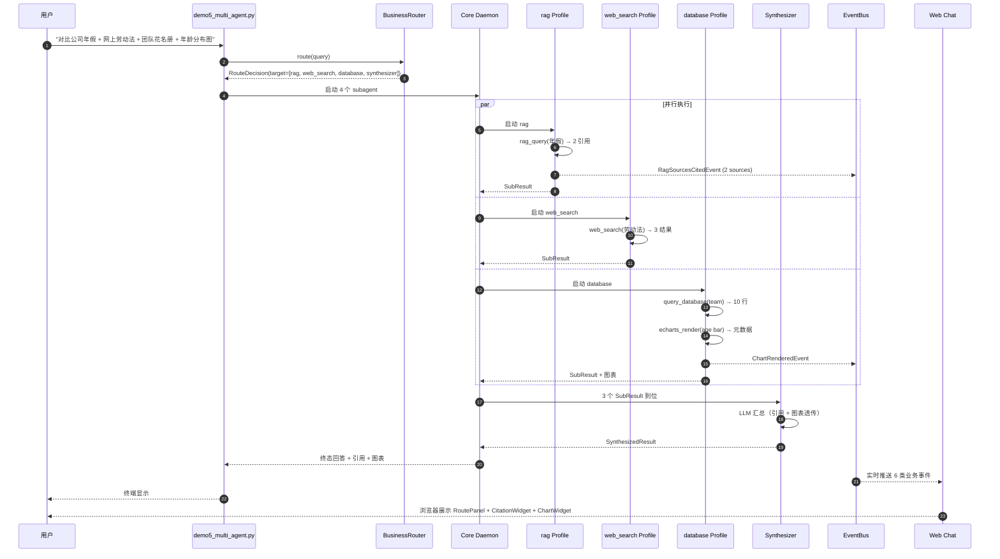

# Demo 5：综合多 Agent（政策 + 外部 + 图表 + 团队）

> **能力**：BusinessRouter 多意图路由 → 多 Profile 并行 → Synthesizer 汇总 → 跨所有组件。
> **Wave 来源**：Wave 2 B（BusinessRouter + SynthesizerRunner）+ Wave 3（Web 端事件展示）+ Wave 4（真实 RAG/DB）+ Wave 5.1/5.2（Dashboard）。
> **Web 端查看**：Chat 页面 + RoutePanel + CitationWidget + ChartWidget + 业务事件流。

## 1. 演示目标

让用户看到 kivi-agent 能**端到端打通所有核心组件**：多意图路由 + 真实 RAG + 真实 DB + 图表 + 业务事件 + 团队协作 + 引用溯源 + ECharts 真画图。

这是**最重要的演示**——按 Wave 7 计划，它是验收"Web/业务 Tool/多 Agent/记忆/评估形成完整闭环"的关键。

## 2. 输入

### 2.1 Fixture

`demos/fixtures/demo5_multi_task_input.json`（4 个子任务）：

```json
{
  "task_id": "demo5-multi-001",
  "user_input": "对比公司年假制度 + 网上最新劳动法 + 团队成员花名册 + 画一张团队年龄分布图",
  "sub_tasks": [
    {
      "sub_id": "A",
      "type": "rag",
      "query": "公司年假制度",
      "fixture": "demos/fixtures/demo2_rag_fixture.txt"
    },
    {
      "sub_id": "B",
      "type": "web_search",
      "query": "2026 年最新劳动法带薪年假规定",
      "fixture": null
    },
    {
      "sub_id": "C",
      "type": "database",
      "query": "查询团队成员花名册（姓名、年龄、岗位）",
      "fixture": "demos/fixtures/demo3_database_fixture.sql"
    },
    {
      "sub_id": "D",
      "type": "chart",
      "query": "画团队年龄分布柱状图",
      "depends_on": ["C"]
    }
  ]
}
```

### 2.2 Spec（用户输入）

```
对比公司年假制度 + 网上最新劳动法 + 团队成员花名册 + 画一张团队年龄分布图
```

### 2.3 路由决策

`BusinessRouter.route(query)` 应识别 4 个意图：

| 意图 | Profile | allowed_tools | concurrency_group |
|---|---|---|---|
| 公司年假 | `rag` | `[rag_query]` | business_rag |
| 网上劳动法 | `web_search` | `[web_search]` | business_web_search |
| 团队花名册 | `database` | `[query_database, echarts_render]` | business_database |
| 年龄分布图 | `database`（复用 C） | `[query_database, echarts_render]` | business_database |

**priority_order**: `[rag, web_search, database]`，追加 `synthesizer`。

## 3. 期望输出

### 3.1 命令行输出

```
$ uv run python -m demos.demo5_multi_agent

=== Demo 5: 综合多 Agent（政策 + 外部 + 图表 + 团队）===

[Step 1] 接收任务：对比公司年假制度 + 网上最新劳动法 + 团队花名册 + 画团队年龄分布图
[Step 2] BusinessRouter 路由（多意图检测）
        - 命中"公司" → rag
        - 命中"网上""最新" → web_search
        - 命中"团队""花名册""分布图" → database
        - 决策：target_profiles=[rag, web_search, database, synthesizer]
        - priority_order=[rag, web_search, database]

[Step 3] 并行启动 3 个子 Profile（Synthesizer 后启动）
        ├─ rag Profile（子任务 A）
        │   - 调用 rag_query(query="年假制度")
        │   - 返回 2 条引用（政策 1 + 政策 2）
        │
        ├─ web_search Profile（子任务 B）
        │   - 调用 web_search(query="2026 年最新劳动法年假")
        │   - 返回 3 条搜索结果
        │
        └─ database Profile（子任务 C + D）
            - 调用 query_database(sql="SELECT name, age, position FROM team")
            - 返回 10 行
            - 调用 echarts_render(type="bar", data=ages)
            - 返回图表元数据

[Step 4] Synthesizer 汇总
        - 接收 3 个 SubResult
        - LLM 合成统一回答
        - 引用透传：2 (rag) + 3 (web) = 5 引用
        - 图表透传：1 图表元数据

[Step 5] 终态回答

=== 回答（综合报告）===

## 1. 公司年假制度（内部）

根据公司政策 1：员工每年享受 10 天带薪年假，工作满 5 年增至 15 天。
申请需提前 3 个工作日通过 HR 系统提交。

## 2. 2026 年最新劳动法规定（外部）

根据搜索结果：
- 《职工带薪年休假条例》规定：职工累计工作满 1 年不满 10 年的，年休假 5 天
- 满 10 年不满 20 年的，年休假 10 天
- 满 20 年的，年休假 15 天

## 3. 对比分析

| 项目 | 公司政策 | 国家法律 |
|------|----------|----------|
| 基础年假 | 10 天 | 5-15 天（按工龄） |
| 满 5 年 | 15 天 | 10 天（满 10 年才到 10） |

公司政策比国家标准更优：基础年假比国家标准多 5 天；满 5 年即可达到 15 天（国家需满 20 年）。

## 4. 团队花名册

| 姓名 | 年龄 | 岗位 |
|------|------|------|
| 张三 | 28  | 工程师 |
| 李四 | 32  | 产品经理 |
| ...  | ... | ... |

## 5. 团队年龄分布图

[图表元数据已发送至前端渲染]

=== 引用 ===

[1] 政策 1：年假制度（rag, score: 0.92）
[2] 政策 2：远程办公政策（rag, score: 0.65）
[3] 劳动法 2026 解读（web_search）
[4] 职工带薪年休假条例（web_search）
[5] 国务院办公厅通知（web_search）

=== 图表 ===

1 个图表：团队年龄分布柱状图（10 个数据点）

=== T11 + 业务事件流 ===

- llm.thinking: 4 次
- rag.sources_cited: 1 次（2 个引用）
- chart.rendered: 1 次
- 团队 agent 利用：rag 1 + web_search 1 + database 1 + synthesizer 1 = 4 个 subagent

=== T11 指标 ===

team_success_rate: 1.0       # 4 个子任务全完成
delegation_accuracy: 1.0     # 路由正确
handoff_quality: 0.95        # 子结果无缝交给 Synthesizer
coordination_latency_s: 3.2  # 并行加速
agent_utilization: 1.0       # 4 个 agent 都跑了
role_consistency: 1.0        # 每个 agent 守自己的职责

=== T12 + Eval 指标 ===

task_completion_rate: 1.0
rag_citation_accuracy: 1.0
tool_selection_accuracy: 1.0
avg_latency_seconds: 4.5
total_tokens: 8543
total_cost_usd: 0.25

=== Demo 5 状态：PASS（耗时 5.1s）===
```

### 3.2 截图位

<!-- screenshot -->

> 截图位置：Web Chat → 问"对比公司年假..." → 看到：
> - RoutePanel：4 个子 Profile（rag / web_search / database / synthesizer）
> - CitationWidget：5 条引用
> - ChartWidget：年龄分布柱状图
> - BusinessEvent 流时间轴

### 3.3 Web Dashboard 显示

- **Chat 页面**：综合报告（Markdown 渲染）+ RoutePanel + CitationWidget + ChartWidget
- **Eval Dashboard**：`task_completion_rate` / `agent_utilization` / `total_tokens` / `total_cost_usd` 指标
- **Team Dashboard**：`team_success_rate` / `delegation_accuracy` / `handoff_quality` 指标

## 4. 复现命令

### 4.1 跑单个 demo

```bash
# 1. 启 Core Daemon
uv run kivi-core &

# 2. 跑 demo
uv run python -m demos.demo5_multi_agent
# → 应看到 "Demo 5 状态：PASS"
# → 应看到综合报告 + 4 个子任务结果
# → 耗时约 5 秒（3 个 Profile 并行）
```

### 4.2 Web 端查看

```bash
# 1. 启 Gateway
uv run kivi-gateway &

# 2. 启前端
cd apps/web-chat && npm run dev

# 3. 浏览器访问 http://localhost:5173/chat
# 4. 输入"对比公司年假制度 + 网上最新劳动法 + 团队花名册 + 画团队年龄分布图"
# 5. 等待 5-8 秒
# → 看到 RoutePanel + CitationWidget + ChartWidget
```

### 4.3 跑全量 5 demo

```bash
# 跑全部 5 demo + 汇总报告
uv run python -m demos.run_all
# → reports/demo_summary.json
# → {
#      "demo1": {"status": "pass", "elapsed_s": 3.2},
#      "demo2": {"status": "pass", "elapsed_s": 1.8},
#      "demo3": {"status": "pass", "elapsed_s": 2.4},
#      "demo4": {"status": "skip", "reason": "WT-K2 未做"},
#      "demo5": {"status": "pass", "elapsed_s": 5.1}
#    }
```

## 5. 故障排查

### 5.1 Synthesizer 汇总失败

**症状**：

```
synthesizer.completed not emitted
# 或 Demo 5 状态 FAIL
```

**排查**：

```bash
# 1. 看 Synthesizer 日志
tail -100 ~/.kivi/logs/core.log | grep -E "(synthesizer|synth)"

# 2. 看 SubResult 是否完整
curl -fsS http://127.0.0.1:8000/api/dashboard/runs | jq '.[].events[] | select(.data.sub_results)'
```

**修复**：

- 确认所有子 Profile 完成（SubResult 都到位）
- 确认 `core/agents/synthesizer.py::SynthesizerRunner.run()` 正常返回

### 5.2 引用 / 图表缺失

**症状**：综合报告正确但 CitationWidget / ChartWidget 空白。

**排查**：

```bash
# 1. 看事件流
curl -fsS http://127.0.0.1:8000/api/dashboard/runs | jq '.[].events[] | {type, data}'

# 2. 确认事件类型
# - RagSourcesCitedEvent
# - ChartRenderedEvent
```

**修复**：

- 确认 `BusinessEventHandler` 订阅了所有 6 类事件
- 确认前端 `useBusinessEvents` composable 正确分发

### 5.3 并行 subagent 没加速

**症状**：demo 5 耗时 12 秒（应该 5 秒），串行了。

**原因**：`SynthesizerRunner` 没真正并行。

**修复**：

- 检查 `core/agents/synthesizer.py` 用 `asyncio.gather` 还是顺序 `await`
- 确认每个子 Profile 都有独立 `sub_run_id`

### 5.4 LLM 超时

**症状**：

```
httpx.ReadTimeout
```

**修复**：

- 调高 `KIVI_LLM_TIMEOUT_S=120.0`
- 减少子任务数（demo 5 是 4 个子任务，是压力测试）

## 6. 数据流



## 7. 关键文件

| 文件 | 说明 |
|---|---|
| `demos/demo5_multi_agent.py` | 演示脚本（WT-K2 交付） |
| `demos/fixtures/demo5_multi_task_input.json` | 4 个子任务定义 |
| `demos/fixtures/demo2_rag_fixture.txt` | 复用 demo 2 fixture |
| `demos/fixtures/demo3_database_fixture.sql` | 复用 demo 3 fixture |
| `src/kivi_agent/core/agents/business_router.py` | `BusinessRouter`（关键词路由） |
| `src/kivi_agent/core/agents/synthesizer.py` | `SynthesizerRunner`（多 Profile 并行） |
| `src/kivi_agent/core/bus/handlers/business.py` | `BusinessEventHandler`（6 类事件订阅） |
| `src/kivi_agent/gateway/event_bridge.py` | WebSocket 事件推送 |
| `src/kivi_agent/eval/team/team_runner.py` | T11 Team Runner |
| `src/kivi_agent/eval/metrics/team.py` | T11 6 指标 |
| `apps/web-chat/src/components/RoutePanel.vue` | 路由面板 |
| `apps/web-chat/src/components/CitationWidget.vue` | RAG 引用 |
| `apps/web-chat/src/components/ChartWidget.vue` | ECharts 真画图 |

## 8. 验收标准

- [ ] `BusinessRouter` 正确识别 4 个意图
- [ ] 3 个子 Profile 并行执行（耗时 ≈ max(单 Profile)，不是 sum）
- [ ] `Synthesizer` 汇总 + 引用透传 + 图表透传
- [ ] 6 类业务事件全部触发（`llm.thinking` / `rag.sources_cited` / `chart.rendered` 等）
- [ ] Web 端 RoutePanel 显示 4 个 Profile
- [ ] Web 端 CitationWidget 显示 5 条引用
- [ ] Web 端 ChartWidget 渲染年龄分布柱状图
- [ ] 跑过：`Demo 5 状态：PASS`，耗时 < 10s

## 9. 后续阅读

- [demo1_coding.md](demo1_coding.md)：编程 Agent
- [demo2_rag.md](demo2_rag.md)：知识库 Agent
- [demo3_database.md](demo3_database.md)：数据库 Agent
- [demo4_frontend_map.md](demo4_frontend_map.md)：前端操作 Agent
- [../architecture/architecture.md §5.2](../architecture/architecture.md)：multi_agent 流程 sequence
